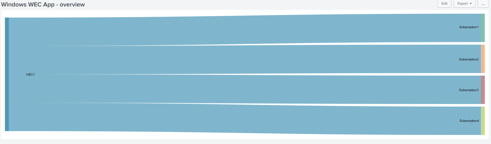
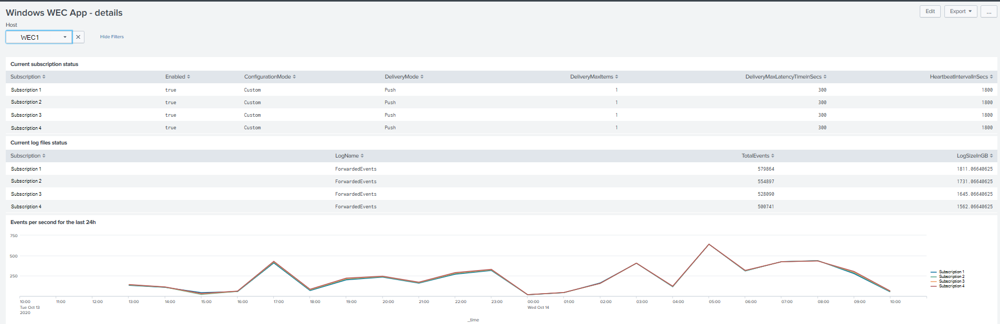
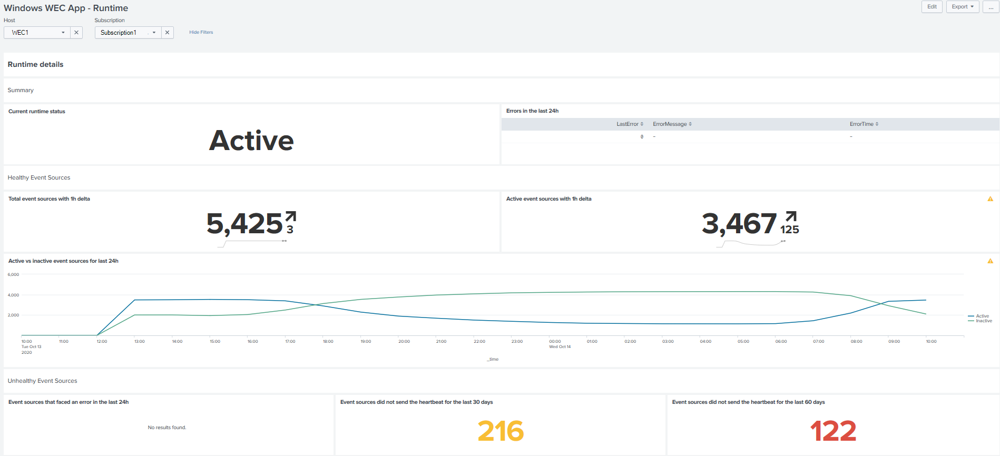
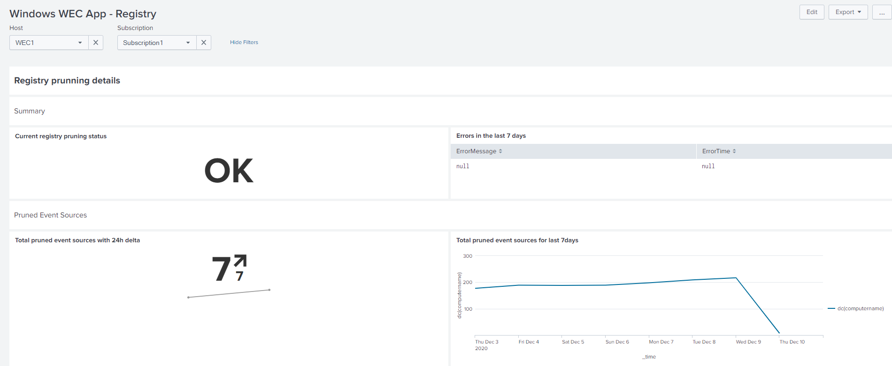

# TA_windows_wec_app Splunk App

This App for Splunk provides some dashboards for Windows WEC telemetry data retrieved using the [Windows WEC Add-On](https://splunkbase.splunk.com/app/5007/)

Dashboards:

- **Overview** shows the relationship between hosts (WEC servers) and the configured subscriptions.

- **Details** provides the details of the subscriptions configured in a host (WEC server).

- **Runtime** provides the runtime status of a given subscription configured in a host (WEC server).

- **Registry** provides the status of the registry pruning of a given subscription configured in a host (WEC server).

## Requirements

The **Overview** dashboard requires the installation of the visualization [Sankey Diagram](https://splunkbase.splunk.com/app/3112/).

## Configuration

The dashboards use the macro *windows_wec_default_index* to provide the index from where to search. By default, it uses _windows*_. Change the index name, if needed.

## Credits

- [Event Log icon](https://icons8.com/icons/set/event-log) icon by [Icons8](https://icons8.com)